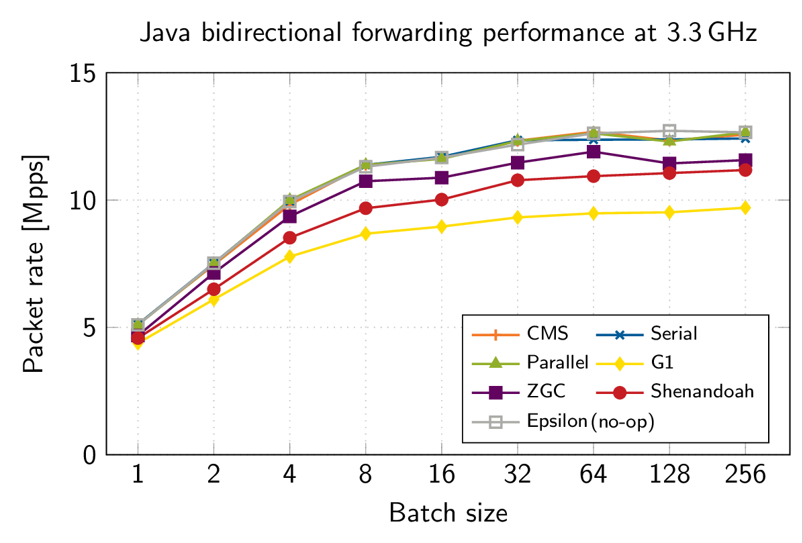

# Java Garbage Collector Comparison

OpenJDK 12 offers 7 different garbage collectors that all impact performance and latency in our driver in different ways.
ixy.java tries to avoid allocations wherever possible, but it's virtually impossible to write allocation-free idiomatic Java code, so we still allocate around 20 bytes on average per forwarded packet.

Epsilon, a garbage collector that never frees memory, is the fastest but it also crashes after a few minutes as it runs out of memory. The new Shenandoah collector doesn't do too well, unfortunately.
Some GCs are as fast as the no-op implementation, this is because never freeing memory isn't ideal either: leaking memory leads to poor data locality as the heap fills up.

But throughput isn't everything, let's look at the latency.

That's... not great. Go and C# managed to keep tail latency below 100µs, see [language comparison](README.md). Even Epsilon is quite slow, so there's something else going on, probably the JIT compiler.
These tests already show the steady state by excluding the first 5 seconds because Java drops packets and shows excessive latencies during startup.

The best garbage collectors for drivers written in Java seem to be ZGC and Parallel with the best trade-offs between performance and latency.