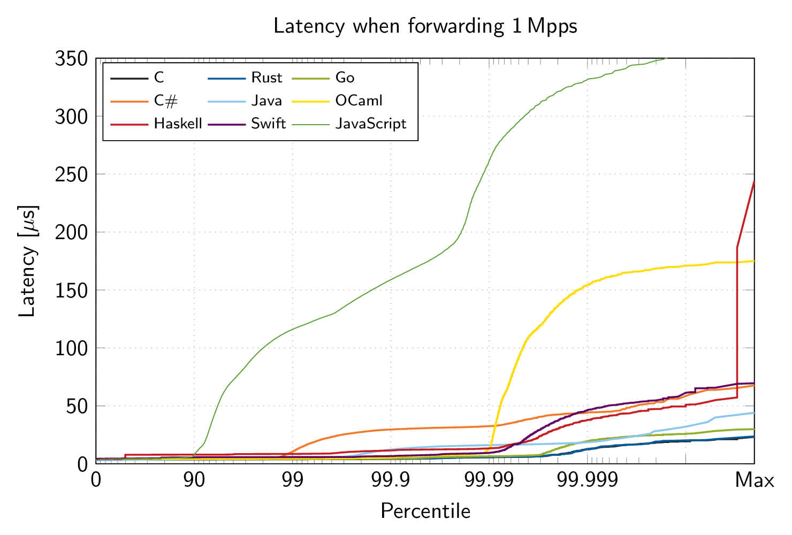
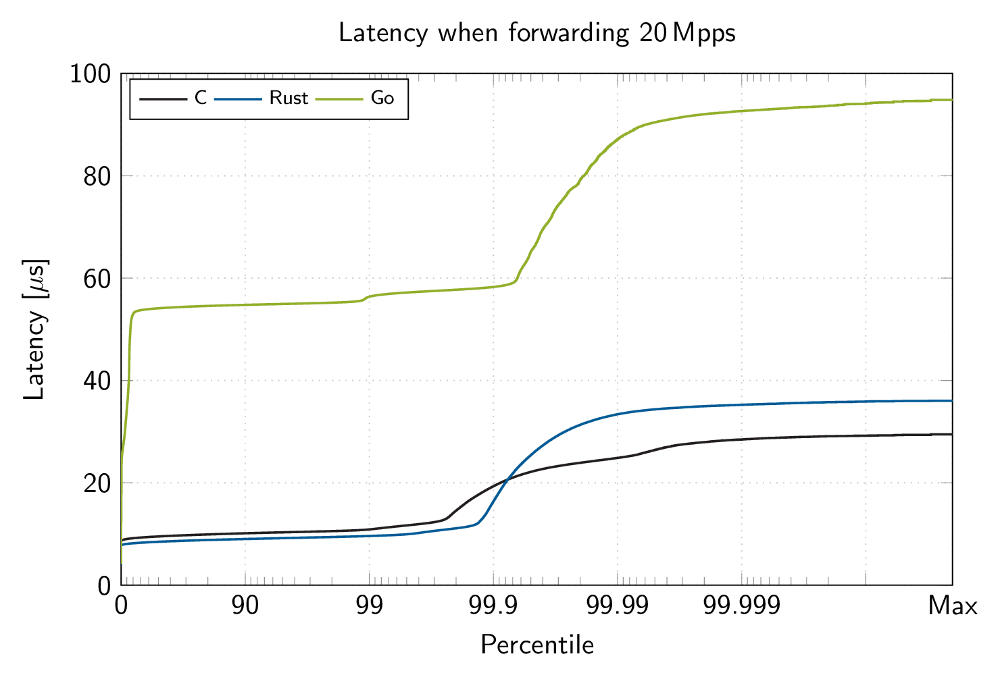

Overview
=========

Ixy is an educational user space network driver for the Intel ixgbe family of 10 Gbit/s NICs (82599ES aka X520, X540, X550, X552, ...).
Its goal is to show that writing a super-fast network driver can be surprisingly simple, check out the [full description in the main repository of the C implementation](https://github.com/emmericp/ixy) to learn about the basics of user space drivers.
Ixy was originally written in C as lowest common denominator of system programming languages, but it is possible to write user space drivers in any programming language.

Check out our research paper ["The Case for Writing Network Drivers in High-Level Languages"](https://www.net.in.tum.de/fileadmin/bibtex/publications/papers/the-case-for-writing-network-drivers-in-high-level-languages.pdf) [[BibTeX](https://www.net.in.tum.de/publications/bibtex/highleveldrivers.bib)] or watch the recording of our [talk at 35C3](https://media.ccc.de/v/35c3-9670-safe_and_secure_drivers_in_high-level_languages) to learn more.

Yes, these drivers are really a full implementation of an actual PCIe driver in these languages; they handle everything from setting up DMA memory to receiving and transmitting packets in a high-level language. You don't need to write any kernel code to build drivers!
Some languages require a few lines of C stubs for features not offered by the language; usually related to getting the memory address of buffers or calling mmap in the right way. But all the core logic is in high-level languages; the implementations are about 1000 lines of code each.

| Language | Code                                                    | Status   | Full evaluation | 
|----------|---------------------------------------------------------|----------|-----------------|
| C        | [ixy.c](https://github.com/emmericp/ixy)*                | Finished | [Paper](https://www.net.in.tum.de/fileadmin/bibtex/publications/papers/ixy-writing-user-space-network-drivers.pdf) |
| Rust     | [ixy.rs](https://github.com/ixy-languages/ixy.rs)       | Finished | [Thesis](https://www.net.in.tum.de/fileadmin/bibtex/publications/theses/2018-ixy-rust.pdf), [Rust vs. C performance comparison](Rust-vs-C-performance.md) |
| Go       | [ixy.go](https://github.com/ixy-languages/ixy.go)       | Finished | [Thesis](https://www.net.in.tum.de/fileadmin/bibtex/publications/theses/2018-ixy-go.pdf) |
| C#       | [ixy.cs](https://github.com/ixy-languages/ixy.cs)       | Finished | [Thesis](https://www.net.in.tum.de/fileadmin/bibtex/publications/theses/2018-ixy-c-sharp.pdf) |
| Java   | [ixy.java](https://github.com/ixy-languages/ixy.java)      | Finished      | (WIP), [GC comparison](Java-garbage-collectors.md) |
| OCaml    | [ixy.ml](https://github.com/ixy-languages/ixy.ml)       | Finished      | [Documentation](https://github.com/ixy-languages/ixy.ml/blob/master/README.md) |
| Haskell  | [ixy.hs](https://github.com/ixy-languages/ixy.hs)       | Finished      | [Thesis](https://www.net.in.tum.de/fileadmin/bibtex/publications/theses/2019-ixy-haskell.pdf) |
| Swift    | [ixy.swift](https://github.com/ixy-languages/ixy.swift) | Finished      | [Documentation](https://github.com/ixy-languages/ixy.swift/blob/master/README.md) |
| Javascript   | [ixy.js](https://github.com/ixy-languages/ixy.js)      | Finished      | (WIP) |
| Python   | [ixy.py](https://github.com/ixy-languages/ixy.py)*      | Finished      | (WIP) |

*) also features a VirtIO driver for easy testing in VMs with Vagrant

This repository here is only a short summary of the project, check out the repositories and full evaluations linked above for all the gory details.

Performance
============
Our [benchmarking script](https://github.com/ixy-languages/benchmark-scripts) for the [MoonGen packet generator](https://github.com/emmericp/MoonGen) loads the forwarder example application with full bidirectional load at 20 Gbit/s with 64 byte packets (29.76 Mpps).
The forwarder then increments one byte in the packet to ensure that the packet is loaded all the way into the L1 cache.
Correct functionality of the forwarder is also tested by the script by validating sequence numbers.

A main driver of performance for network drivers is sending/receiving packets in batches from/to the NIC.
Ixy can already achieve a high performance with relatively low batch sizes of 32-64 because it is a full user space driver.
Other user space packet processing frameworks like netmap that rely on a kernel driver need larger batch sizes of 512 and above to amortize the larger overhead of communicating with the driver in the kernel.
Running this on a single core of a Xeon E3-1230 v2 CPU yields these throughput results in million packets per second (Mpps) when varying the batch size.

*Notes on multi-core:* Some languages implement multi-threading for ixy, but some can't or are limited by the language's design (e.g., the GIL in Python and OCaml). However, this isn't a real problem because multi-threading within one process isn't really necessary.
Network cards can split the traffic at the hardware level (via a feature called RSS), the traffic can then be distributed to independent different processes.
For example, [Snabb](https://github.com/snabbco/snabb) works like this and many DPDK applications use multiple threads that do not communicate (shared-nothing architecture).

Latency
=======

Average and median latency is the same regardless of the programming language as latency is dominated by buffering times, the [evaluation script](https://github.com/ixy-languages/benchmark-scripts) can sample the latency of up to 1000 packets per second with hardware timestamping (precision: 12.8 nanoseconds).
This yields somewhat interesting results depending on queue sizes and NUMA configuration, see the [ixy paper](https://www.net.in.tum.de/fileadmin/bibtex/publications/papers/ixy-writing-user-space-network-drivers.pdf) for an evaluation.

Latency spikes induced by languages featuring a garbage collector might not be caught by the test setup above.
We have a second test setup to catch this: we also capture *all* packets before and after the device under test with fiber optic taps and use [MoonSniff](https://github.com/AP-Frank/MoonGen/tree/moonsniff) to acquire hardware timestamps (25.6 nanosecond precision) for all packets.

Running the forwarder on an Intel Xeon E5-2620 v3 at 2.4 GHz yields the following results for the forwarding latency.

How to read this graph: the x axis refers to the percentage of packets that can be forwarded in this time. For example, if a language takes longer than 100µs for only one packet in 1000 packets, it shows a value of 100µs at x position 99.9.
This graph focuses on the tail latency, note the logarithmic scaling on the x axis.

Graphs only include languages that can cope with the offered load.
Measuring an overloaded driver doesn't make sense as latency is dominated by the buffer size in this scenario.
